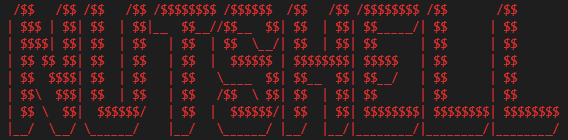

# NutShell
[![Issues][issues-shield]][issues-url]


<!-- PROJECT LOGO -->
<br />
<p align="center">
  <a href="https://github.com/amills12/NutShell.gitn">
    
  </a>
   <h3 align="center">NUTSHELL</h3>
  <p align="center">
This project is a command interpreter for a Korn shell-like command language in C/C++
using Lex and Yacc running under Unix. This shell can parse command lines and execute the
appropriate command(s). The core of the shell consists of simple commands, pipes, I/O redirection,
environment variables, aliases, pathname searching, wild-carding and tilde expansion.
    <br />
    <br />
    <br />
    ·
    <a href="https://github.com/amills12/NutShell/issues">Report Bug</a>
    ·
    <a href="https://github.com/amills12/NutShell/issues">Request Feature</a>
  </p>
</p>


<!-- TABLE OF CONTENTS -->
## Table of Contents
* [Task List](#task-list)
  * [complete](#complete)
  * [incomplete](#incomplete)
* [About the Project](#about-the-project)
  * [Built With](#built-with)
* [Getting Started](#getting-started)
  * [Prerequisites](#prerequisites)
  * [Installation](#installation)
* [Features](#features)
* [Contact](#contact)

<!-- Task List -->
## Task List
1. Nutshell.l (Joseph/Alex)
2. Nutshell.y (Joseph/Alex)
3. Nutshell.h (Joseph/Alex)
4. Nutshell.cpp (Joseph/Alex)
5. Environment Variables (Joseph/Alex)
6. Aliases (Joseph/Alex)
7. Change Directory (Joseph)
8. Wildcard matching (Joseph)
9. Tilde Expansion (Joseph)
10. Command line arguments (Alex)
11. Pipes (Alex)
12. File IO Redirection (Alex)
13. Error Redirection (Alex)
14. Makefile (Alex)
15. README (Joseph)
16. Styling (Joseph/Alex)
17. Testing (Joseph/Alex)

<!-- Complete -->
### Complete
#### 1. Environment Variables
  - **Setenv variable word** - Working   
  - **unsetenv variable** - Working
  - **printenv** - Working
  
#### 2. Change Directory
  - **CD** - Working 
  - **CD WORD** - Working

#### 3. Aliases
  - **Alias Name Command** - Working    
  - **Unalias Name** -  Working  
  - **Alias** - Working
  
#### 4. Wildcard Matching
  - ***.Word** - Working
  - **Word.*** - Working

#### 5. Command line arguments
  - **[linux arg list](https://ss64.com/bash/)** - Working
 
#### 6. Pipes
  - **&** - Working
  - **I/O Redirection** - Working
  - **Error Redirection** - Working


<!-- Incomplete -->
### Incomplete
#### 1. Tilde Expansion (Partially):
  - **~** - Working
  - **cd ~** - Working
  - **~/** - Working
  - **cd ~/** - Working
  - **cd ~user** - Untested
  - **cd ~/dir** - Not working
  - **cd ~/ dir** - Working (needs a space between the "/"  and "dir" to expand the tilde)
  - **setenv char ~** - Not Working
<!-- ABOUT THE PROJECT --> 
## About The Project

Command interpreter for a Korn shell-like command language in C/C++
using Lex and Yacc running under Unix.

### Built With
* [VSCode](https://code.visualstudio.com/)
* [VMWare](https://www.vmware.com/)
* Reptilian
* C
* C++
* Lex/Flex
* Yacc/Bison

<!-- GETTING STARTED -->
## Getting Started

Installation should be simple. You install VMWare, set up Reptilian, Install VSCode and the necessary libraries, clone the repo, run Make to compile and ./nutshell to use the shell. 

### Prerequisites
#### 1. Install VMWare Workstation Pro 15.5 or later

#### 2. Download [Reptilian VM Image](www.cise.ufl.edu/research/reptilian/downloads/Reptilian-latest.ova)
  1) Double-click on the Reptilian VM image file, then click “Import”.
  2) Optionally, as a sound card (right-click on VM → Settings → Add → Sound Card → Finish).
  3) To connect to the VM, you will need its IPv4 address. To get it, start the VM, open
  the start menu, and go to Settings → System → About Tablet → IP Address. With it,
  you can connect to the VM through SSH via WSL (replace with your IP address):
  
  ```sh
  finn@BMO:~$ ssh reptilian@192.168.11.130 Password is 'reptilian'
  ```
  
  4) Build a fresh Kernel in the /usr/rep/src directory and clone the kernel repository
  ```sh
  reptilian@localhost$ cd /usr/rep/src
  
  reptilian@localhost$ git clone https://github.com/uf-cise-os/reptilian-kernel.git
  
  reptilian@localhost$ cd reptilian-kernel
  
  reptilian@localhost$ make
  
  reptilian@localhost$ sudo make install; sudo make modules_install
  ```
#### 3. Install VSCode and the necessary plug-ins
  1) Remote SSH
  2) Remote SSH: Editing Configuration Files
  3) Remote WSL


<!-- Installation -->
### Installation

#### 1. Clone the repo
```sh
reptilian@localhost$ git clone https://github.com/amills12/NutShell.git
```
#### 2. Run Make to compile the project
```
reptilian@localhost$ make
```
#### 3. Use the following command to run the shell
```sh
reptilian@localhost$ ./nutshell        
```

<!-- Features -->
## Features
### 1. Environment Variables
  - **Setenv variable word:** This command sets the value of the variable variable to be word. 
  
  - **unsetenv variable:** This command will remove the binding of variable. If the variable is
    unbound, the command is ignored.

  - **printenv:** This command prints out the values of all the environment variables, in the format
    variable=value, one entry per line.
  
### 2. Change Directory
  - **CD:**  This command changes the directory to Home.
  
  - **CD WORD:**  This command changes the directory to word.
  
### 3. Aliases
  - **Alias Name Command:**  Adds a new alias to the shell.
  
  - **Unalias Name:**   Remove the alias for name.
  
  - **Alias:**  lists all available aliases.
  
### 4. Wildcard Matching
  - ***.Word :**  The word isreplaced with alphabetically sorted filenames that match the pattern

  - **Word.*:**  The word isreplaced with alphabetically sorted filenames that match the pattern

### 5. Command line arguments
  - **[linux arg list](https://ss64.com/bash/)**
 
### 6. Pipes

### 7. Tilde Expansion (Partially)

<!-- CONTACT -->
## Contact

Joseph - JosephMorales007@Yahoo.com
[![LinkedIn][linkedin-shield]][linkedin-url-joseph]

Alex -  Millsalexander97@gmail.com


Project Link: [https://github.com/amills12/NutShell](https://github.com/amills12/NutShell.git)


<!-- ACKNOWLEDGEMENTS -->
## Acknowledgements
* [University of Florida](https://www.ufl.edu/)


<!-- MARKDOWN LINKS & IMAGES -->
<!-- https://www.markdownguide.org/basic-syntax/#reference-style-links -->
[linkedin-shield]: https://img.shields.io/badge/-LinkedIn-black.svg?style=flat-square&logo=linkedin&colorB=555
[linkedin-url-joseph]: https://www.linkedin.com/in/josephmorales007/

[issues-shield]: https://img.shields.io/github/issues/amills12/NutShell/issues.svg?style=flat-square
[issues-url]: https://github.com/amills12/NutShell/issues
[product-screenshot]: images/screenshot.png
